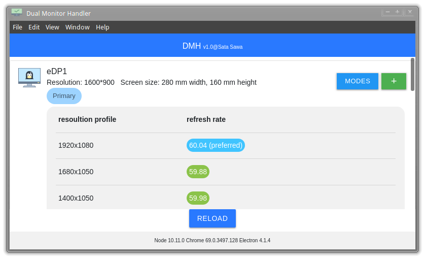

# DMH (Dual Monitor Helper)

## Introduction
On some Linux distribution, newly connected monitor may not detect resolution profile correctly, (i.e. It only recognizes low resolution profiles like 1024x768). This application aims at solving this problem. When you plug your display to the interface, you can use DMH to add new resolution profiles. All profiles created by DMH is temperory added and this program will not apply the monitor setting automatically.

## Support Platform
- [x] Linux

## Dependency
- Xrandr
- Electron
